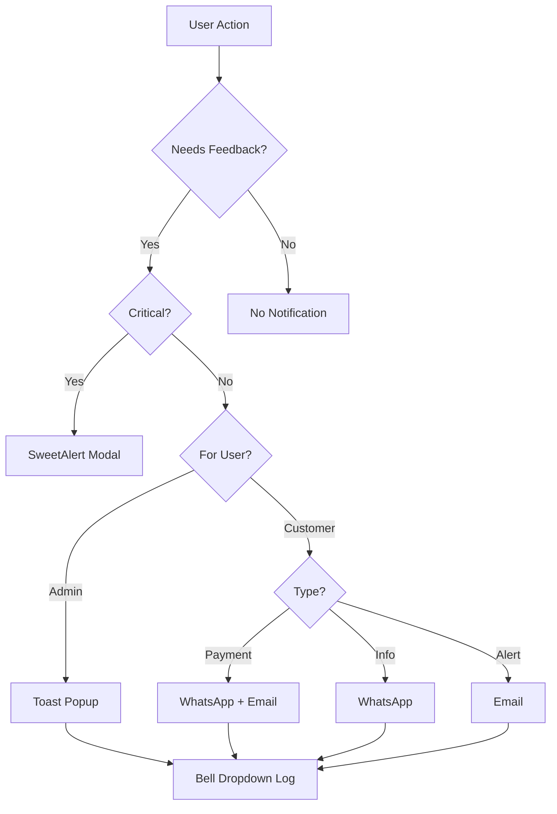

# 🔔 SALFANET RADIUS - Complete Notification System

Dokumentasi lengkap sistem notifikasi SALFANET RADIUS setelah enhancement dari AIBILL.

## 📋 Table of Contents

- [Overview](#overview)
- [Notification Types](#notification-types)
- [1. Bell Dropdown Notifications](#1-bell-dropdown-notifications)
- [2. Toast Notifications (NEW)](#2-toast-notifications-new)
- [3. Dashboard Alert Widget (NEW)](#3-dashboard-alert-widget-new)
- [4. WhatsApp Notifications](#4-whatsapp-notifications)
- [5. Email Notifications](#5-email-notifications)
- [Usage Examples](#usage-examples)
- [Best Practices](#best-practices)

---

## 🎯 Overview

SALFANET RADIUS memiliki 5 jenis sistem notifikasi yang terintegrasi:

| Type | Location | Use Case | Dismissal |
|------|----------|----------|-----------|
| **Bell Dropdown** | Top navbar | In-app activity log | Manual |
| **Toast Popups** | Bottom-right corner | Quick feedback | Auto (3-5s) |
| **Alert Widget** | Dashboard | System status | Persistent |
| **WhatsApp** | External app | Customer communication | N/A |
| **Email** | External app | Official correspondence | N/A |

---

## 📊 Notification Types

### When to Use Each Type



---

## 1. 🔔 Bell Dropdown Notifications

**Location:** Top navbar (NotificationDropdown component)

### Features
- ✅ Real-time notification count badge
- ✅ Mark as read/unread
- ✅ Mark all as read
- ✅ Notification history
- ✅ Auto-refresh every 30 seconds

### Types
- User registration
- Payment approval
- Invoice generated
- Session expired
- System alerts

### Usage

```typescript
// Create notification in database
await prisma.notification.create({
  data: {
    userId: adminId,
    type: 'user_registered',
    title: 'New User Registration',
    message: `${username} has registered`,
    link: `/admin/users/${userId}`,
  },
});
```

### Example Implementation

```typescript
// src/app/api/admin/registrations/[id]/approve/route.ts
export async function POST(request: NextRequest) {
  // ... approval logic ...
  
  // Send notification to all admins
  const admins = await prisma.user.findMany({
    where: { role: 'ADMIN' },
  });

  for (const admin of admins) {
    await prisma.notification.create({
      data: {
        userId: admin.id,
        type: 'registration_approved',
        title: 'Registration Approved',
        message: `${registration.name} has been approved`,
        link: `/admin/pppoe-users/${newUser.id}`,
      },
    });
  }
}
```

---

## 2. 🍞 Toast Notifications (NEW)

**Location:** Bottom-right corner of screen

### Features
- ✅ Non-blocking popup messages
- ✅ Auto-dismiss after 3-5 seconds
- ✅ Multiple toast stacking
- ✅ Variants: success, error, info, warning
- ✅ Custom duration
- ✅ Action buttons (optional)

### When to Use
- Quick success/error feedback
- Non-critical status updates
- Operation confirmations
- Background task completions

### Basic Usage

```typescript
import { useToast } from "@/components/ui/use-toast";

function MyComponent() {
  const { toast } = useToast();

  const handleSubmit = async () => {
    try {
      await saveData();
      
      toast({
        title: "✅ Success",
        description: "Data saved successfully",
      });
    } catch (error) {
      toast({
        variant: "destructive",
        title: "❌ Error",
        description: error.message,
      });
    }
  };
}
```

### Variants

```typescript
// Success (default)
toast({
  title: "Success",
  description: "Operation completed",
});

// Error
toast({
  variant: "destructive",
  title: "Error",
  description: "Something went wrong",
});

// Custom styled
toast({
  title: "Warning",
  description: "Please check your input",
  className: "bg-orange-50 border-orange-200",
});
```

### Real-World Examples

#### User Creation
```typescript
const handleCreateUser = async (data: UserData) => {
  try {
    const response = await fetch('/api/admin/users', {
      method: 'POST',
      body: JSON.stringify(data),
    });

    if (response.ok) {
      toast({
        title: "✅ User Created",
        description: `${data.username} has been added successfully`,
      });
      router.refresh();
    }
  } catch (error) {
    toast({
      variant: "destructive",
      title: "Failed to create user",
      description: error.message,
    });
  }
};
```

#### Payment Approval
```typescript
const handleApprovePayment = async (paymentId: string) => {
  toast({
    title: "⏳ Processing",
    description: "Approving payment...",
    duration: 2000,
  });

  const response = await fetch(`/api/manual-payments/${paymentId}/approve`, {
    method: 'POST',
  });

  if (response.ok) {
    toast({
      title: "💰 Payment Approved",
      description: "User balance has been updated",
    });
  }
};
```

#### Invoice Generation
```typescript
const handleGenerateInvoices = async () => {
  toast({
    title: "⏳ Generating Invoices",
    description: "This may take a few moments...",
    duration: 2000,
  });

  const response = await fetch('/api/invoices/generate', {
    method: 'POST',
  });

  const data = await response.json();

  toast({
    title: "✅ Invoices Generated",
    description: `${data.count} invoices created successfully`,
  });
};
```

---

## 3. 📊 Dashboard Alert Widget (NEW)

**Location:** Admin dashboard (below stats, above traffic monitor)

### Features
- ✅ Color-coded system alerts
- ✅ Icon-based visual indicators
- ✅ Timestamp display
- ✅ Persistent display
- ✅ Configurable max alerts

### Alert Types

| Type | Color | Icon | Use Case |
|------|-------|------|----------|
| `success` | Green | ✓ CheckCircle | System healthy, tasks completed |
| `error` | Red | ✗ XCircle | Critical errors, service down |
| `warning` | Orange | ⚠ AlertCircle | Resource warnings, pending actions |
| `info` | Blue | ℹ Info | Updates available, reminders |

### Usage

```typescript
// src/app/admin/page.tsx
const [systemAlerts, setSystemAlerts] = useState([
  {
    id: '1',
    type: 'success' as const,
    title: 'System Healthy',
    message: 'All services running normally',
    timestamp: new Date(),
  },
  {
    id: '2',
    type: 'warning' as const,
    title: 'High Memory Usage',
    message: 'System memory at 85%',
    timestamp: new Date(),
  },
  {
    id: '3',
    type: 'info' as const,
    title: 'Update Available',
    message: 'SALFANET RADIUS v2.10.0 is available',
    timestamp: new Date(),
  },
]);

return (
  <AlertWidget 
    alerts={systemAlerts} 
    maxAlerts={3} 
    title="System Alerts"
  />
);
```

### Dynamic Alerts from API

```typescript
// Check system status and generate alerts
const checkSystemHealth = async () => {
  const alerts = [];

  // Check RADIUS status
  const radiusStatus = await fetch('/api/system/radius');
  const radiusData = await radiusStatus.json();
  
  if (!radiusData.running) {
    alerts.push({
      id: 'radius-down',
      type: 'error',
      title: 'RADIUS Service Down',
      message: 'FreeRADIUS is not running',
      timestamp: new Date(),
    });
  }

  // Check pending invoices
  const pendingCount = await getPendingInvoicesCount();
  
  if (pendingCount > 50) {
    alerts.push({
      id: 'pending-invoices',
      type: 'warning',
      title: 'High Pending Invoices',
      message: `${pendingCount} invoices need attention`,
      timestamp: new Date(),
    });
  }

  // Check expired vouchers
  const expiredVouchers = await getExpiredVouchersCount();
  
  if (expiredVouchers > 0) {
    alerts.push({
      id: 'expired-vouchers',
      type: 'info',
      title: 'Expired Vouchers',
      message: `${expiredVouchers} vouchers expired today`,
      timestamp: new Date(),
    });
  }

  setSystemAlerts(alerts);
};
```

### Real-Time Monitoring

```typescript
// Auto-refresh alerts every 5 minutes
useEffect(() => {
  checkSystemHealth();
  
  const interval = setInterval(() => {
    checkSystemHealth();
  }, 5 * 60 * 1000); // 5 minutes

  return () => clearInterval(interval);
}, []);
```

---

## 4. 📱 WhatsApp Notifications

**Location:** External WhatsApp app via Fonnte API

### Features
- ✅ Template-based messages
- ✅ Variable replacement ({{name}}, {{amount}}, etc.)
- ✅ Configurable per notification type
- ✅ Active/inactive toggle
- ✅ Multi-language support

### Message Types

```typescript
// Available templates
const templates = [
  'registration-approval',
  'installation-invoice',
  'monthly-invoice',
  'payment-approved',
  'payment-overdue',
  'voucher-created',
  'balance-low',
  'service-suspended',
  'service-activated',
];
```

### Usage

```typescript
import { sendRegistrationApproval } from '@/lib/whatsapp-notifications';

// Send approval notification
await sendRegistrationApproval({
  customerName: 'John Doe',
  customerPhone: '628123456789',
  username: 'johndoe',
  password: 'Pass123!',
  profileName: '10 Mbps',
  installationFee: 250000,
});
```

### Template Management

Templates stored in `whatsapp_templates` table:

```sql
CREATE TABLE whatsapp_templates (
  id VARCHAR(36) PRIMARY KEY,
  type VARCHAR(50) NOT NULL UNIQUE,
  name VARCHAR(255) NOT NULL,
  message TEXT NOT NULL,
  variables TEXT,
  isActive BOOLEAN DEFAULT true,
  createdAt DATETIME DEFAULT CURRENT_TIMESTAMP,
  updatedAt DATETIME DEFAULT CURRENT_TIMESTAMP ON UPDATE CURRENT_TIMESTAMP
);
```

### Example Template

```
🎉 *Selamat, Registrasi Disetujui!*

Halo {{customerName}},

Registrasi Anda telah disetujui! ✅

📝 *Detail Akun:*
Username: {{username}}
Password: {{password}}
Paket: {{profileName}}

💰 *Biaya Instalasi:*
{{installationFee}}

Tim kami akan menghubungi Anda untuk jadwal instalasi.

Terima kasih,
{{companyName}}
📞 {{companyPhone}}
```

### Variable Replacement

```typescript
// Variables in template: {{customerName}}, {{amount}}
const variables = {
  customerName: 'John Doe',
  amount: 'Rp 100.000',
};

// Result: "Halo John Doe, tagihan Anda: Rp 100.000"
```

---

## 5. 📧 Email Notifications

**Location:** Email via Nodemailer

### Features
- ✅ HTML email templates
- ✅ PDF invoice attachments
- ✅ Configurable SMTP
- ✅ Email queue system
- ✅ Retry logic

### Types
- Invoice delivery
- Payment receipts
- Service notifications
- Account statements

### Usage

```typescript
import { sendInvoiceEmail } from '@/lib/email-notifications';

await sendInvoiceEmail({
  to: 'customer@example.com',
  invoiceNumber: 'INV-2025-001',
  amount: 100000,
  dueDate: new Date(),
  pdfPath: '/path/to/invoice.pdf',
});
```

---

## 🎯 Usage Examples

### Complete User Registration Flow

```typescript
// src/app/api/admin/registrations/[id]/approve/route.ts
export async function POST(request: NextRequest) {
  const { id } = params;
  
  // 1. Approve registration
  const registration = await prisma.pppoE_Registration.update({
    where: { id },
    data: { status: 'APPROVED' },
  });

  // 2. Create user account
  const newUser = await prisma.pppoE_User.create({
    data: {
      username: registration.username,
      password: hashedPassword,
      // ... other fields
    },
  });

  // 3. Generate invoice
  const invoice = await generateInstallationInvoice(newUser.id);

  // 4. Send notifications
  
  // 4a. Bell notification to admins
  const admins = await prisma.user.findMany({ where: { role: 'ADMIN' } });
  for (const admin of admins) {
    await prisma.notification.create({
      data: {
        userId: admin.id,
        type: 'registration_approved',
        title: 'Registration Approved',
        message: `${registration.name} has been approved`,
        link: `/admin/pppoe-users/${newUser.id}`,
      },
    });
  }

  // 4b. Toast notification (client-side)
  // Client will show: toast({ title: "✅ Registration Approved" })

  // 4c. WhatsApp to customer
  await sendRegistrationApproval({
    customerName: registration.name,
    customerPhone: registration.phone,
    username: newUser.username,
    password: plaintextPassword,
    profileName: profile.name,
    installationFee: profile.installationFee,
  });

  // 4d. Email invoice
  await sendInstallationInvoice({
    customerEmail: registration.email,
    invoiceNumber: invoice.invoiceNumber,
    amount: invoice.amount,
    dueDate: invoice.dueDate,
    pdfPath: invoice.pdfPath,
  });

  // 4e. Dashboard alert (system monitoring)
  // Will appear in AlertWidget: "New user approved"

  return NextResponse.json({
    success: true,
    message: 'Registration approved successfully',
  });
}
```

### Payment Processing Flow

```typescript
// src/app/api/manual-payments/[id]/approve/route.ts
export async function POST(request: NextRequest) {
  const { id } = params;

  // 1. Approve payment
  const payment = await prisma.manual_Payment.update({
    where: { id },
    data: { status: 'APPROVED' },
  });

  // 2. Update user balance
  await updateUserBalance(payment.userId, payment.amount);

  // 3. Mark invoice as paid
  await markInvoiceAsPaid(payment.invoiceId);

  // 4. Notifications

  // 4a. Toast (admin)
  // Client: toast({ title: "💰 Payment Approved" })

  // 4b. Bell notification
  await prisma.notification.create({
    data: {
      userId: payment.userId,
      type: 'payment_approved',
      title: 'Payment Approved',
      message: `Your payment of ${formatCurrency(payment.amount)} has been approved`,
    },
  });

  // 4c. WhatsApp
  await sendPaymentApproved({
    customerPhone: user.phone,
    customerName: user.name,
    amount: payment.amount,
    invoiceNumber: invoice.invoiceNumber,
  });

  // 4d. Email receipt
  await sendPaymentReceipt({
    customerEmail: user.email,
    amount: payment.amount,
    receiptNumber: payment.receiptNumber,
  });

  return NextResponse.json({ success: true });
}
```

---

## 💡 Best Practices

### 1. Choose the Right Notification Type

| Scenario | Notification Type |
|----------|------------------|
| User creates a record | Toast (success) |
| Critical error occurs | SweetAlert modal |
| Background task completes | Toast + Bell notification |
| System status change | AlertWidget + Bell |
| Customer payment due | WhatsApp + Email |
| Admin action needed | Bell notification |

### 2. Error Handling

```typescript
try {
  await saveData();
  
  toast({
    title: "Success",
    description: "Data saved",
  });
} catch (error) {
  // Always handle notification failures gracefully
  console.error('Failed to save:', error);
  
  toast({
    variant: "destructive",
    title: "Error",
    description: "Failed to save data. Please try again.",
  });
}
```

### 3. Don't Over-notify

```typescript
// ❌ Bad: Too many notifications
toast({ description: "Loading..." });
toast({ description: "Saving..." });
toast({ description: "Validating..." });
toast({ description: "Done!" });

// ✅ Good: Minimal notifications
toast({ description: "Processing...", duration: 1000 });
// ... do work ...
toast({ description: "Saved successfully!" });
```

### 4. Batch Notifications

```typescript
// ❌ Bad: Multiple toasts
invoices.forEach(invoice => {
  toast({ description: `Invoice ${invoice.id} generated` });
});

// ✅ Good: Single summary toast
toast({
  title: "Invoices Generated",
  description: `${invoices.length} invoices created successfully`,
});
```

### 5. Notification Priority

```
1. SweetAlert Modal - Critical actions (delete, logout)
2. Toast Popup - Quick feedback (success/error)
3. Bell Dropdown - Historical log (all actions)
4. Dashboard AlertWidget - System monitoring
5. WhatsApp/Email - External communication
```

---

## 🔧 Configuration

### Toast Duration

```typescript
// Default: 3000ms (3 seconds)
toast({
  description: "Quick message",
  duration: 2000, // 2 seconds
});

// Persistent (manual dismiss)
toast({
  description: "Important notice",
  duration: Infinity,
});
```

### AlertWidget Display

```typescript
// Show only 3 most recent alerts
<AlertWidget alerts={alerts} maxAlerts={3} />

// Custom title
<AlertWidget 
  alerts={alerts} 
  title="Recent System Events"
  maxAlerts={5}
/>
```

### WhatsApp Settings

```typescript
// src/lib/whatsapp.ts
const FONNTE_API_KEY = process.env.FONNTE_API_KEY;
const FONNTE_API_URL = 'https://api.fonnte.com/send';
```

---

## 📊 Monitoring & Analytics

### Track Notification Delivery

```sql
-- Bell notifications read rate
SELECT 
  type,
  COUNT(*) as total,
  SUM(CASE WHEN isRead THEN 1 ELSE 0 END) as read_count,
  ROUND(SUM(CASE WHEN isRead THEN 1 ELSE 0 END) * 100.0 / COUNT(*), 2) as read_rate
FROM notifications
GROUP BY type;
```

### WhatsApp Delivery Status

```sql
-- Check WhatsApp message logs
SELECT 
  type,
  status,
  COUNT(*) as count
FROM whatsapp_logs
GROUP BY type, status;
```

---

## 🚀 Future Enhancements

### Planned Features
- [ ] FCM Push Notifications (mobile app)
- [ ] Telegram notifications
- [ ] SMS notifications (Twilio)
- [ ] Notification preferences per user
- [ ] Scheduled notifications
- [ ] Notification templates editor UI

---

## 📚 Related Documentation

- [Toast Notifications Guide](./TOAST_NOTIFICATIONS_GUIDE.md)
- [WhatsApp Setup](./WHATSAPP_SETUP.md)
- [Email Configuration](./EMAIL_CONFIGURATION.md)
- [Testing Guide](./TESTING_GUIDE.md)

---

**Version:** 2.9.0+notifications  
**Last Updated:** 2025-01-XX  
**Maintainer:** SALFANET RADIUS Team
